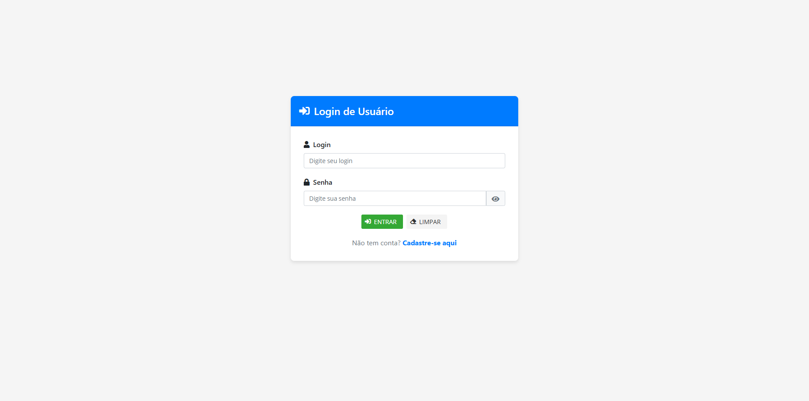
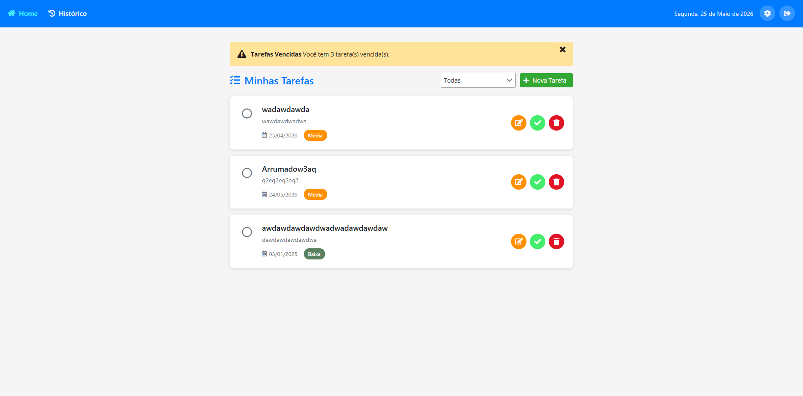
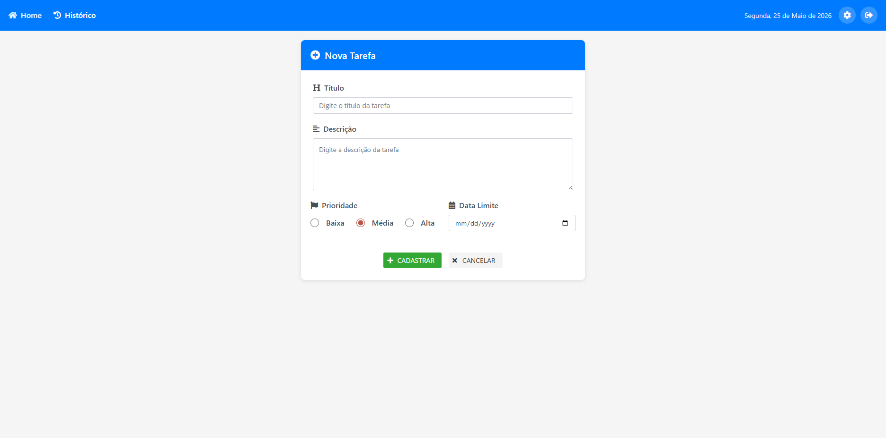
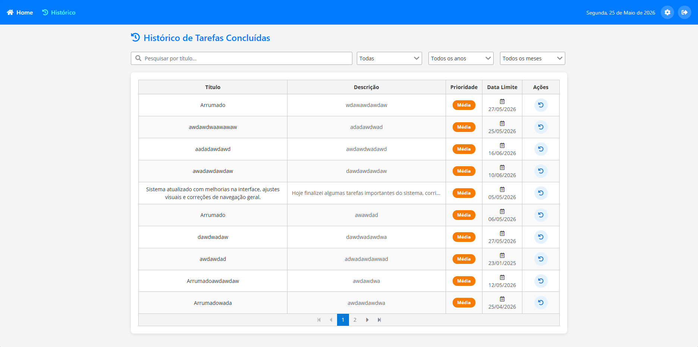
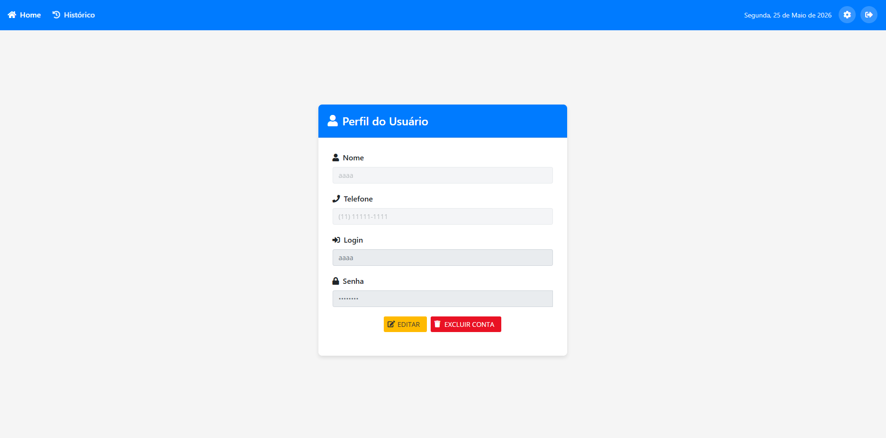
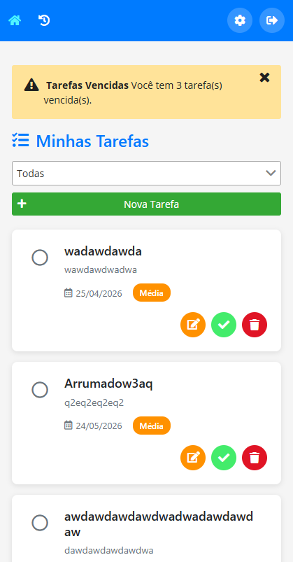

# Projeto Fixação Cepein

> Aplicação Angular para gerenciamento de tarefas com CRUD de usuários via API REST e persistência local de tarefas.

## Screenshots

| Login | Home |
|---|---|
|  |  |

| Nova Tarefa | Histórico |
|---|---|
|  |  |

| Perfil | Mobile |
|---|---|
|  |  |

## Funcionalidades

- Autenticação de usuários (login/cadastro)
- CRUD de tarefas (criar, editar, excluir, concluir)
- Filtros: prioridade, ano, mês, pesquisa por título
- Histórico de tarefas concluídas com PrimeNG DataTable
- Reabrir tarefas do histórico
- Perfil do usuário (editar dados, excluir conta)
- Notificação de tarefas vencidas (p-messages)
- Filtros sincronizados com query params na URL
- Design responsivo (mobile, tablet, desktop)

## Tech Stack

| Tecnologia | Versão |
|---|---|
| Angular | 8.2 |
| PrimeNG | 8.1 |
| Bootstrap | 4.3 |
| Font Awesome | 5.15 |
| RxJS | 6.4 |
| TypeScript | 3.5 |

### Componentes PrimeNG utilizados

| Componente | Onde é usado |
|---|---|
| `p-table` | Histórico de tarefas |
| `p-dialog` | Modal de confirmação de exclusão |
| `p-inputText` | Campos de texto nos formulários |
| `p-dropdown` | Filtros na Home e Histórico |
| `p-button` | Todos os botões da aplicação |
| `p-messages` | Notificação de tarefas vencidas |
| `p-message` | Mensagens de erro inline nos formulários |

## Pré-requisitos

- Node.js 12+ (recomendado 16.x)
- npm 6+
- Angular CLI 8.3 (`npm install -g @angular/cli@8`)

## Instalação e execução

```bash
# Clone o repositório
git clone <url-do-repositorio>
cd projeto-fixacao-cepein-angular

# Instale as dependências
npm install

# Inicie o servidor de desenvolvimento
npm start
```

Acesse `http://localhost:4200`

> **Nota:** O backend Java (Spring Boot) deve estar rodando em `http://localhost:8080` para as funcionalidades de autenticação e perfil.

## Estrutura do Projeto

```
src/
├── app/
│   ├── components/
│   │   ├── card-tarefa/              ← @Input / @Output
│   │   │   ├── card-tarefa.component.ts
│   │   │   ├── card-tarefa.component.html
│   │   │   └── card-tarefa.component.css
│   │   ├── form-tarefa/              ← Formulário reativo + validação customizada
│   │   ├── layouts/
│   │   │   ├── main-layout/          ← Navbar principal
│   │   │   └── auth-layout/          ← Layout de autenticação
│   │   └── pages/
│   │       ├── home/                 ← Lista de tarefas + p-messages (vencidas)
│   │       ├── login/                ← Autenticação com RxJS
│   │       ├── cadastro/             ← Registro de usuário
│   │       ├── perfil/               ← Edição/exclusão de conta
│   │       ├── historico-tarefa/     ← p-table + query params + filtros
│   │       └── not-found/            ← 404
│   ├── models/
│   │   ├── tarefa.model.ts           ← Tarefa, enum Prioridade
│   │   └── usuario.model.ts          ← Usuario, UsuarioDTO, UsuarioUpdateDTO
│   ├── services/
│   │   ├── tarefa.service.ts         ← localStorage CRUD
│   │   └── usuario.service.ts        ← API REST (HttpClient + Observable)
│   └── validators/
│       └── custom.validators.ts      ← Validação customizada (dataFutura)
├── environments/
│   ├── environment.ts                ← apiUrl: localhost:8080
│   └── environment.prod.ts
└── styles.css                        ← Estilos globais
```

## Rotas

| Rota | Componente | Descrição |
|---|---|---|
| `/` | HomeComponent | Lista de tarefas pendentes |
| `/perfil` | PerfilComponent | Dados do usuário logado |
| `/historico` | HistoricoTarefaComponent | Tarefas concluídas com filtros |
| `/tarefa/nova` | FormTarefaComponent | Criar nova tarefa |
| `/tarefa/editar/:id` | FormTarefaComponent | Editar tarefa existente |
| `/auth/login` | LoginComponent | Login do usuário |
| `/auth/cadastro` | CadastroComponent | Cadastro de novo usuário |
| `**` | NotFoundComponent | Página 404 |

### Query Parameters

O histórico usa query params para persistir os filtros na URL:

```
/historico?titulo=relatorio&prioridade=alta&ano=2025&mes=3
```

## API (Backend)

Base URL: `http://localhost:8080/usuario`

| Método | Endpoint | Descrição |
|---|---|---|
| POST | `/cadastrar` | Cadastrar usuário |
| GET | `/login?login={login}` | Buscar usuário por login |
| PUT | `/alterar-login/{id}` | Alterar dados do usuário |
| DELETE | `/excluir/{id}` | Excluir conta |

## Funcionalidades em destaque

### Validação customizada

Validador `dataFutura()` que impede o cadastro de tarefas com data limite no passado:

```typescript
export function dataFutura(): ValidatorFn {
  return (control: AbstractControl): ValidationErrors | null => {
    if (!control.value) return null
    const data = new Date(control.value)
    const hoje = new Date()
    hoje.setHours(0, 0, 0, 0)
    return data < hoje ? { dataFutura: true } : null
  }
}
```

### @Input / @Output

Comunicação entre `HomeComponent` (pai) e `CardTarefaComponent` (filho):

```typescript
// CardTarefaComponent
@Input() tarefa!: Tarefa
@Output() editar = new EventEmitter<Tarefa>()
@Output() excluir = new EventEmitter<Tarefa>()
@Output() toggleConcluida = new EventEmitter<Tarefa>()
```

```html
<!-- HomeComponent -->
<app-card-tarefa
  [tarefa]="tarefa"
  (editar)="editar($event)"
  (excluir)="excluir($event)"
  (toggleConcluida)="toggleConcluida($event)">
</app-card-tarefa>
```

### Query Parameters

Filtros do histórico são sincronizados com a URL via `ActivatedRoute`:

```typescript
// Leitura ao carregar
this.pesquisaTitulo = this.route.snapshot.queryParamMap.get('titulo') || ''

// Atualização ao filtrar
this.atualizarUrl()  // navigate([], { queryParams, relativeTo: this.route })
```
